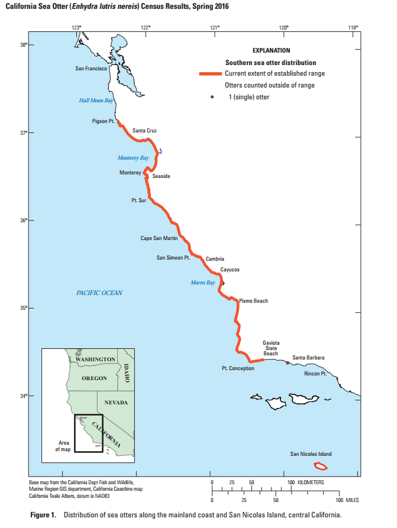

```{r setup, include=FALSE}
knitr::opts_chunk$set(echo = TRUE, warning = FALSE, message = FALSE)
library(tidyverse)
library(here)
library(janitor)
library(rgdal)
library(sf)
library(tmap)
library(lubridate)
```

Sea Otter Strandings
```{r}
sea_otter_data <- read_csv(here("data", "Table2_StrandedSeaOtter_byLifeStage_1985_2017.csv")) %>% 
  clean_names() %>% 
  pivot_longer(cols = 3:20, names_to = "life_stage", values_to = "count") %>% 
  select(!total) %>% 
  mutate(life_stage = case_when(
    life_stage == "pups_f" ~ "Pups:female",
    life_stage == "juvenile_f" ~ "Juvenile:female",
    life_stage == "sub_adult_f" ~ "Subadult:female",
    life_stage == "adult_f" ~ "Adult:female",
    life_stage == "old_adult_f" ~ "Old_adult:female",
    life_stage == "unknown_f" ~ "Unknown:female",
    life_stage == "pups_m" ~ "Pups:male",
    life_stage == "juvenile_m" ~ "Juvenile:male",
    life_stage == "sub_adult_m" ~ "Subadult:male",
    life_stage == "adult_m" ~ "Adult:male",
    life_stage == "old_adult_m" ~ "Old_adult:male",
    life_stage == "unknown_m" ~ "Unknown:male",
    life_stage == "pups_u" ~ "Pups:unknown",
    life_stage == "juvenile_u" ~ "Juvenile:unknown",
    life_stage == "sub_adult_u" ~ "Subadult:unknown",
    life_stage == "adult_u" ~ "Adult:unknown",
    life_stage == "old_adult_u" ~ "Old_adult:unknown",
    life_stage == "unknown_u" ~ "Unknown:unknown"
  )) %>% 
  separate(life_stage, c("life_stage", "sex"))

ggplot(data = sea_otter_data, aes(x = year,
                                  y = count)) +
      geom_col(aes(fill = "life_stage")) 
```

Sea Otter Annual Census
```{r}
census_sea_otter <- read_csv(here("data", "AnnualCaliforniaSeaOtter_Census_summary_1985_2014.csv")) %>% 
  clean_names()

sea_otter_pop <- census_sea_otter %>%
  select(year, zone_code) %>% 
  group_by(year, zone_code) %>% 
  count(year)

sea_otter_pop[is.na(sea_otter_pop)] <- 0

sea_otter_pop %>% 
  ungroup()
```

Stranded Sea Otter by Geographic Location
```{r}
geog_sea_otter <- read_csv(here("data", "Table1_StrandedSeaOtter_byGeographicAreas_1985_2017.csv")) %>% 
  clean_names() %>% 
  select(!total_strandings) %>% 
  pivot_longer(cols = 2:15, names_to = "location", values_to = "count") %>% 
  mutate(year = as.character(year)) %>% 
  mutate(location = case_when(
    location == "north_of_pigeon_pt" ~ "North of Pigeon Point",
    location == "pigeon_pt_to_capitola" ~ "Pigeon Point to Capitola",
    location == "capitola_to_seaside" ~ "Capitola to Seaside",
    location == "seaside_to_pt_lobos" ~ "Seaside to Point Lobos",
    location == "pt_lobos_to_pt_sur" ~ "Point Lobos to Point Sur",
    location == "pr_sur_to_dolan_rock" ~ "Point Sur to Dolan Rock",
    location == "dolan_rock_to_c_san_martin" ~ "Dolan Rock to Cape San Martin",
    location == "c_san_martin_to_san_simeon_point" ~ "Cape San Martin to San Simeon Point",
    location == "san_simeon_pt_to_cayucos" ~ "San Simeon Point to Cayucos",
    location == "cayucos_to_hazard_canyon" ~ "Cayucos to Hazard Canyon",
    location == "hazard_canyon_to_pismo_beach" ~ "Hazard Canyon to Pismo Beach",
    location == "pismo_beach_to_point_sal" ~ "Pismo Beach to Point Sal",
    location == "pt_sal_to_pt_conception" ~ "Point Sal to Point Conception",
    location == "se_of_pt_conception" ~ "Southeast of Point Conception"
  )) %>% 
  drop_na
```

Stranded Sea Otter by Year and Month
```{r}
pop_sea_otter <- read_csv(here("data", "Table3_StrandedSeaOtter_byYearAndMonth_1985_2017.csv")) %>% 
  clean_names() %>% 
  select(!total) %>% 
  pivot_longer(cols = 3:14, names_to = "month", values_to = "count")
```

Sea otter Linear Density
```{r}
locations_sea_otters <- read_sf(here("data", "shapefile_2019", "Census_sum_2019.shp")) %>% 
  clean_names() %>% 
  mutate_at(vars(lin_dens), funs(round(.,1)))


st_crs(locations_sea_otters)

california_cities <- read_sf(here("data", "tl_2016_06_place.shp")) %>%
  clean_names() %>% 
  filter(namelsad == c("Santa Cruz", "Capitola", "Seascape", "Point Lobos", "Cayucos", "Watsonville", "Monterrey", "Carmel", "Santa Barbara"))

st_crs(california_cities)

ggplot() +
  geom_sf(data = locations_sea_otters, aes(color = zone)) +
  geom_sf(data = california_cities)

tmap_mode("view")

tm_shape(locations_sea_otters) +
  tm_polygons("lin_dens", border.alpha = 0) +
  tm_fill("lin_dens") +
  tm_borders(alpha = 0)
```

## Summary

This app helps visualize Southern Sea Otter stranding and linear density data. The data is from the U.S. Geological Survey.

The Southern Sea Otter (*Enhydra lutris nereis*) is a threatened and depleted species. Sea otters play an important role in the ecosystem. Sea otters consume sea urchins, which means that the urchins cannot feed on kelp as much. In places where sea otters no longer roam, sea urchins have taken over and eliminated kelp forests, depleting coastal productivity. To the right is a map of the Southern sea otter current range.

```{r}
#

#
```

**Data Citation Annual Sea Otter Census:** Yee, J.L., and Tinker, M.T., 2018, Annual California Sea Otter Census, 1985-2014:U.S. Geological Survey data release.

**Data Citation Sea Otter Strandings:** Hatfield, B.B., Harris, M.D., Young, C., Ames, J.A., and Tinker, M.T., 2018, Summary of stranded southern sea otters, 1985-2017 (ver. 2.0, September 2018): U.S. Geological Survey data release, https://doi.org/10.5066/F71J98P4."
